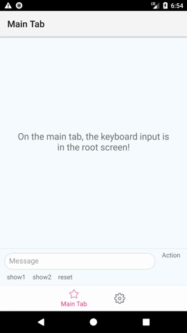

# React Native Keyboard Input

Presents a React component as an input view which replaces the system keyboard. Can be used for creating custom input views such as an image gallery, stickers, etc.

Supports both iOS and Android.

   

# Installation
Install the package from npm:

`yarn add react-native-keyboard-input` or `npm i --save react-native-keyboard-input`

## Android

Update your dependencies in `android/app/build.gradle`:

```gradle
dependencies {
  // Add this dependency:
  compile project(":reactnativekeyboardinput")
}
```

Update your `android/settings.gradle`:

```gradle
include ':reactnativekeyboardinput'
project(':reactnativekeyboardinput').projectDir = new File(rootProject.projectDir, '../node_modules/react-native-keyboard-input/lib/android')
```

In your `MainApplication.java`, add to the `getPackages()` list:

```java
import com.wix.reactnativekeyboardinput.KeyboardInputPackage;

@Override
protected List<ReactPackage> getPackages() {
  return Arrays.<ReactPackage>asList(
      // Add this package:
      new KeyboardInputPackage(this) // (this = Android application object)
    );
}
```

### ProGuard

If you have pro-guard enabled and are having trouble with your build, apply this to your project's main `proguard-rules.pro`:

```
-dontwarn com.wix.reactnativekeyboardinput.**
```

## iOS
In Xcode, drag both `RCTCustomInputController.xcodeproj` and `KeyboardTrackingView.xcodeproj` from your `node_modules` to the Libraries folder in the Project Navigator, then add `libRCTCustomInputController.a` and `libKeyboardTrackingView.a` to your app target "Linked Frameworks and Libraries".

#### Covering the whold keyboard in predictive mode
To utilize this feature you'll need to add `KeyboardTrackingView` to your projects scheme build action.

From Xcode menu:
 
 1. `product -> scheme -> manage schemes -> double-click your project`
 2. Slect build at the right menu, click the + icon at the bottom of the targets list and select `KeyboardTrackingView`.
 3. Drag and position `KeyboardTrackingView` to be first, above your project, and unmark "Parallelize Build" option at the top.

If necessary, you can take a look at how it is set-up in the demo project.


# Usage

There are 2 main parts necessary for the implementation:

## 1. A keyboard component
Create a component that you wish to use as a keyboard input. For example:

```js
class KeyboardView extends Component {
  static propTypes = {
    title: PropTypes.string,
  };
  render() {
    return (
      <ScrollView contentContainerStyle={[styles.keyboardContainer, {backgroundColor: 'purple'}]}>
        <Text style={{color: 'white'}}>HELOOOO!!!</Text>
        <Text style={{color: 'white'}}>{this.props.title}</Text>
      </ScrollView>
    );
  }
}
```

Now register with the keyboard registry so it can be used later as a keyboard:

```js
import {KeyboardRegistry} from 'react-native-keyboard-input';

KeyboardRegistry.registerKeyboard('MyKeyboardView', () => KeyboardView);
```

When you need to notify about selecting an item in the keyboard, use:

```js
KeyboardRegistry.onItemSelected(`MyKeyboardView`, params);
```

## 2. Using the keyboard component as an input view
While this package provides several component and classes for low-level control over custom keyboard inputs, the easiets way would be to use `KeyboardAccessoryView`. It's the only thing you'll need to show your Keyboard component as a custom input. For example:

```js
<KeyboardAccessoryView
  renderContent={this.keyboardToolbarContent}
  kbInputRef={this.textInputRef}
  kbComponent={this.state.customKeyboard.component}
  kbInitialProp={this.state.customKeyboard.initialProps}
/>
```

| Prop | Type | Description |
| ---- | ---- | ----------- |
| renderContent | Function | a fucntion for rendering the content of the keyboard toolbar |
| kbInputRef | Object | A ref to the input component which triggers the showing of the keyboard |
| kbComponent | String | The registered component name |
| kbInitialProps | Object | Initial props to pass to the registered keyboard component |
| onItemSelected | Function | a callback function for a selection of an item in the keyboard component |

This component takes care of making your toolbar (which is rendered via `renderContent `) "float" above the keyboard (necessary for iOS), and for setting your component as the keyboard input when the `kbComponent` changes.

# Demo

See [demoScreen.js](https://github.com/wix/react-native-keyboard-input/blob/master/demo/demoScreen.js) for a full working example.
