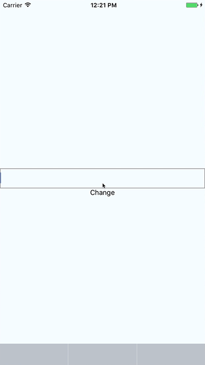

# React Native Custom Input Controller

Presents a React component as input view of text elements.



##Using

Add the project to your `package.json`, run `npm install` and link the iOS project in your own project.

```js
<TextInput
	ref='myTextInput'
	style={{height: 40, borderColor: 'gray', borderWidth: 1, padding: 8, margin: 20}}
/>
```

Obtain the react tag of your text input, and call `CustomInputController.presentCustomInputView` with the react tag and the name of your custom input component:

```js
const reactTag = ReactNative.findNodeHandle(this.refs['myTextInput']);
CustomInputController.presentCustomInputView(reactTag, 'CustomInput');
```

See `examples/AwesomeProject_Chat` for an example.